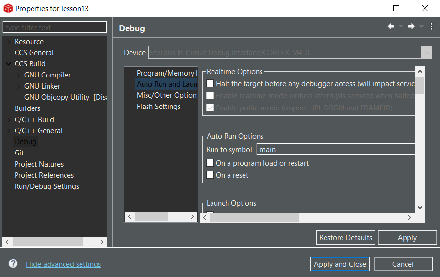

# Embedded Programming Course

In which I go through [Miro Samek's Course](https://www.state-machine.com/video-course/) using the EK-TM4C1294XL development board and Code Composer Studio (CCS) with GCC. CCS is currently at v10.3.1 (July 2021).

## Motivation

I have gone through the course previously, up to and including the RTOS section, using a TM4C123G dev board and the dev tools used in the videos, e.g. IAR Embedded Workbench for ARM (EWARM). There are 10 more videos in the series since the last time I went through. I figured I'd go through the course from the start as it's never a bad idea to get a refresher on the fundamentals. 

Much of the nitty-gritty of e.g. GPIO manipulation is hidden behind vendor-provided hardware abstraction layers. This is generally a good thing, but it's also good to know what to look for when things are not working as expected. And sometimes direct register manipulation is necessary. I'm looking at you, pull configuration registers.

## CCS on Linux

I'm using a Windows 10 machine for most of this course, but set up CCS on a Linux machine as well, as that is the daily driver in my home office.

In order to flash the board, the following install scripts must be run using `sudo` to allow the In-Circuit Debugger to work (substitute current CCS install folder as necessary):

- `~/ti/ccs1031/ccs/install_scripts/install_drivers.sh`
- `~/ti/ccs1031/ccs/install_scripts/ti_permissions_install.sh`

I had to reboot to get the changes to take effect and flash the dev board.

## The Code

Most of the code contained in this repository will be identical to that accessible via the course link above. However, the TM4C1294 dev board has four single-color LEDs vs an RGB LED, so the ports/bits used will be slightly different.

Note that the assembly code generated by CCS may not exactly match the code shown in the videos, due to use of a different IDE/compiler.

In the lesson descriptions below, I will mainly point out differences when using CCS, or any potential "gotchas".

### Lesson 0 - Getting Started

Covers:
- Discussion of the ARM Cortex family
- Installation of IAR EWARM
  - Again, I am using [TI's Code Composer Studio](https://www.ti.com/tool/CCSTUDIO-SAFETY) integrated development environment (IDE)
  - The CCS link is for the "safety" version, select the Tiva family for inclusion during installation
  - Mr. Samek covers installation of CCS in video #19 [GNU-ARM and Eclipse](https://youtu.be/BBF3ZMi8WK4)
- Ordering of the development board
  - IAR EWARM (at least the older version) includes a simulator that will get one through the first few lessons, but eventually real hardware will be needed
  - The TM4C123G Launchpad is equivalent to the board recommended for the course
  - I am using the [EK-TM4C1294XL](https://www.ti.com/lit/ug/spmu365c/spmu365c.pdf) board, as I had one on hand, and I wanted to use something different to force me to look at the [datasheet](https://www.ti.com/lit/ds/symlink/tm4c1294ncpdt.pdf)

### Lesson 1 - Counting

Note that the default optimization in CCS will prevent the counter from working properly. Set compiler optimization to zero for now. The `volatile` keyword will be covered in Lesson 5.

### Lesson 2 - Flow of Control

<u>**Copying Projects:**</u> This is slightly more complicated when using CCS than it is with EWARM. The procedure goes something like this, assuming Win10:
- Navigate to the workspace folder in File Explorer
- Copy the `lesson1` folder and rename it to `lesson2`
  - I've been copying the last lesson to the next one, i.e. lesson[x] to lesson[x+1]
- Open the new folder, then open `.cproject` and `.project` and change all occurrences of e.g. "lesson1" to "lesson2" in each file
- Save the modified `.cproject` and `.project`
- With the overall workspace open in CCS, click <u>F</u>ile &rarr; Import... 
- Select "CCS Projects" &rarr; <u>N</u>ext >
- Click B<u>r</u>owse... next to Select s<u>e</u>arch-directory:
- You should already be in the correct folder - if not, navigate to the workspace folder
- Select the "new" project, then click <u>F</u>inish

### Lesson 3 - Variables and Pointers

### Lesson 4 - Blinking the LED

This is where the code diverges just a bit, due to the differences in the LEDs included on the different boards. Since I couldn't just blindly follow the video to get the register memory locations, I was forced to go to the datasheet. Also, two different ports are used for the four LEDs on the TM4C1294 board, increasing the difficulty level *slightly*. Check the dev board [user manual](https://www.ti.com/lit/ug/spmu365c/spmu365c.pdf) for LED port assignments.

Note the address masking - it is explained better in a later video, where 0x3FC is added to the base port address.

### Lesson 5 - Preprocessor and the Volatile Keyword in C

The required header file `tm4c1294ncpdt.h` was not included with the CCS install. I retrieved a copy from:

>http://users.ece.utexas.edu/~valvano/arm/

Note that this version of the file has been modified to use only the _AHB_ (Advanced High-Performance Bus) memory locations, which are discussed in Lesson 7. All GPIO ports on the TM4C1294 only uses the AHB, and macros `GPIO_PORTF_AHB_DATA_R` and `GPIO_PORTF_DATA_R` map to the same address in the original header. The TM4C123 has ports that also use the ABP bus, so the two macros map to different base addresses.

If you simply place the header file in the same folder as `main.c`, the compiler will find it easily. I like to put headers in an `include` folder, which requires modifying the project properties to add that folder to the places where the compiler looks for includes:

Project &rarr; Properties &rarr; CCS Build &rarr; GNU Compiler &rarr; Directories

### Lesson 6 - Bit-Wise Operators in C

(Re)learned something:
- Logical shift (unsigned values) - Right shifts shift in zeros from the left
- Arithmetic shift (signed values) - Right shifts shift in ones from the left, which makes sense to keep the negative value and two's complement form

### Lesson 7 - Arrays and Pointer Arithmetic

### Lesson 8 - Functions and the Stack

Note that one million (1000000) can also be written as `1e6`. I'm lazy and this method is easier than counting zeros for large values. Similarly 500000 &rarr; 5e5.

### Lesson 9 - Modules, Recursion, AAPCS

AAPCS: ARM Application Procedure Call Standard 

Strayed from the video again, to organize source files (*.c) into a `source` folder. `delay.h` was placed in the `include` foler.

It is not necessary to explicitly add new files to the project when using CCS (Eclipse).

### Lesson 10 - Stack Overflow and Other Pitfalls of Functions

Unfortunately, CCS does not have a nice stack viewer. There is a "Stack Usage" view available when using the TI compiler. I tried it briefly and was unable to actually see anything useful, but I did not try too hard as I'm still trying to use the GCC tools exclusively.

It's still possible to use the Memory Browser to view the stack by examining the region pointed to by the Stack Pointer (SP) register. The "call stack" is shown in the "Debug" window, not quite as nicely as shown in the video using IAR EWARM, but it's there.

Newer versions of CCS do not appear to have a simple way to set heap and stack size in the linker file. They can be set by adding `-heap=0` and/or `-stack=1024` to the "Miscellaneous" flags in the linker settings.

Differences between my final code and the video:
- I have left the factorial lines in place.
- I moved the x & y initializers above the `while (1)` loop. I think this makes the LED blink sequence slightly more interesting as the delay values are being swapped on each iteration of the loop.

### Lesson 11 - Standard Integers <stdint.h> and Mixing Types

I've included the MSP430 version of the lesson code in *lesson11_msp430*. The build behavior is a bit strange; I had to clean the project after each change to the code, otherwise I get the error "no rule to make target" for `msp430.h`. Adding `clean` to the build command, as shown in [this post](https://e2e.ti.com/support/tools/code-composer-studio-group/ccs/f/code-composer-studio-forum/608010/ccs-tms320c5515-forcing-a-clean-before-each-build) fixes the issue for me.

### Lesson 12 - Structures and CMSIS

CMSIS: Cortex Microcontroller Software Interface Standard

GCC has a different keyword to pack structs than the IAR compiler. Use the `__attribute__((packed))` construct between the closing brace and the name:

```C
typedef struct {
    uint16_t x;
    uint8_t y;
} __attribute__((packed)) Point;
```
I did not find a way to select an M0 device for the experiment at ~ the 12:00 minute mark. I selected a few MCU families during CCS installation, but none of those added an M0 "generic" to the variant list. I will take his word for this one.

#### CMSIS File Locations

Much as I hate to grab files from random places, I could not find `tm4c_cmsis.h` at ti.com. 
- Found it at [this GitHub repo](https://github.com/ya2019tester/cmsis/blob/master/tm4c_cmsis.h) and copied it to the project (lesson12) folder.
- The `core_cm4.h` is part of a set of includes that can be installed from the [course page](https://www.state-machine.com/video-course/), lessons 12+. I put those files in c:\ti\CMSIS\ and will add that folder to the project includes as necessary.

I thought the [TIVA-Ware files](http://software-dl.ti.com/tiva-c/SW-TM4C/latest/index_FDS.html) might be useful here, but they do not include the CMSIS header(s).

**Update:** Found CMSIS files for TM4C1294 and other TM4C processors in [this GitHub repo](https://github.com/speters/CMSIS/tree/master/Device/TI/TM4C/Include). In my case I needed to grab `TM4C1294NCPDT.h`, which I renamed to `tm4c1294ncpdt_cmsis.h`, as well as `system_TM4C129.h`, which is a #include in the first one. 

In the GPIOA_AHB_Type struct, change the "RESERVED0" to "DATA_Bits", and make the first column __IO to use the array form as in the video.

I scrambled a bit when he switched to using the CMSIS structures; the required header files are not easily found.

I've also noticed that I need to perform a clean and build occasionally due to spurious errors w/ making `main.o`.

### Lesson 13 - Startup Code Part 1

To change the debugger options to begin in the startup code, bring up the Project->Properties, click through Debug->Auto Run and Launch Options, and uncheck both checkboxes in the Auto Run Options section.



When entering a debug session using CCS/GCC, the entry point is `ResetISR()` in `tm4c1294ncpdt_startup_css_gcc.c`. The processor portion will be different if you are using a TM4C123-based board, of course. The startup assembly routine is quite different than that shown in the video, but the concept is the same. After some register manipulation, the startup code does call the FPU initialization and eventually branches to `main()` in the application code.

Map files are generated by default in CCS.

The map files generated by GCC are...not good, and look nothing like those shown in the video. I created a new project, specifying the TI compiler (V20.2.4.LTS as of this writing), copied in the source and include files and adding the required include folders in the project properties. It is possible to just change the compiler used for an existing project, but did not work as simply for me as I would have liked, and caused errors that I was having trouble fixing. It was faster to just create a new project.

The map file generated by the TI compiler/linker for this project look more like the one shown in the video.

See also:
  [Buried Treasure and Map Files](http://www.youtube.com/watch?v=XRXLUcbJIxY) by [Elicia White](http://www.embedded.fm)

  